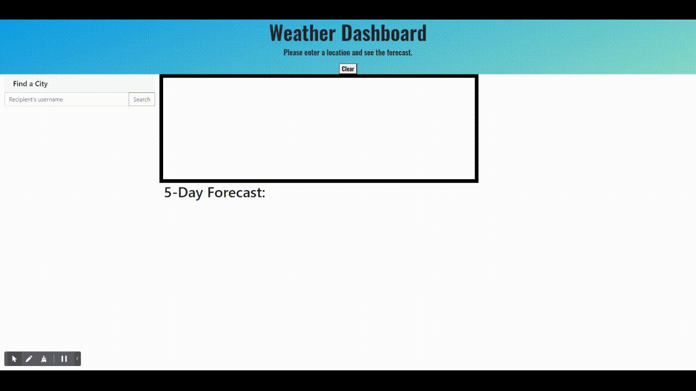

# Weather Dashboard
Created by Siddharth Desai

## Description

The purpose of this porject was to create a weather dashboard using openweathermap API. The user can enter any location around the world and view the current forecast as well as the future five day forecast. If the location the user inputs is invalid a alert will pop up asking the user to input a valid location. Lastly leveraging local storage the user can still maintain their saved location upon reloading the page. This application used a multitude of technologies such as html, css, javascript, jquery, moment.js, and openweathermap.org's weather data.Cancel changes

This project helped me increase my knowledge in javascript and working in front-end technologies such as HTML and CSS. At this point I am very confident in my skills in dyanmically creating a webpage purely through javascript. Also, I learned how to fetch and parse data using and displaying the in the HTML. I am very confident in using third party APIs such as (https://openweathermap.org/api).

## User Story

```
AS A traveler
I WANT to see the weather outlook for multiple cities
SO THAT I can plan a trip accordingly
```

## Acceptance Criteria

```
GIVEN a weather dashboard with form inputs
WHEN I search for a city
THEN I am presented with current and future conditions for that city and that city is added to the search history
WHEN I view current weather conditions for that city
THEN I am presented with the city name, the date, an icon representation of weather conditions, the temperature, the humidity, the wind speed, and the UV index
WHEN I view the UV index
THEN I am presented with a color that indicates whether the conditions are favorable, moderate, or severe
WHEN I view future weather conditions for that city
THEN I am presented with a 5-day forecast that displays the date, an icon representation of weather conditions, the temperature, the wind speed, and the humidity
WHEN I click on a city in the search history
THEN I am again presented with current and future conditions for that city

```


## Table of Content
- [Webpage](#webpage)
- [Installation](#installation)
- [Contact_Information](#contact_information)
- [Credits_and_References](#credits_and_references)
- [License](#license)
- [Links](#links)

<br/>

## Webpage


<br/>



## Installation

* N/A
 


## Contact_Information

```
Email: shdesai118@gmail.com
Cell: 908-883-0191
```

## Credits_and_References
* https://cssgradient.io/gradient-backgrounds/
* https://openweathermap.org/api
* https://fonts.google.com/specimen/Oswald
* https://fonts.google.com/specimen/Open+Sans+Condensed#standard-styles
* https://getbootstrap.com/

## License

This project is free use

## Links
* https://shd118.github.io/Weather-Dashboard/
* https://github.com/SHD118/Weather-Dashboard

